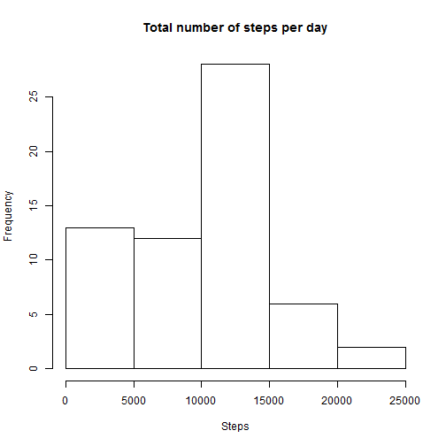
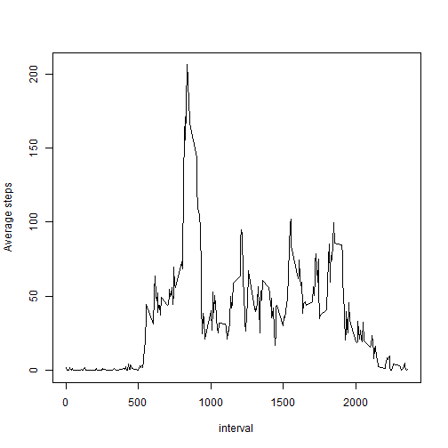
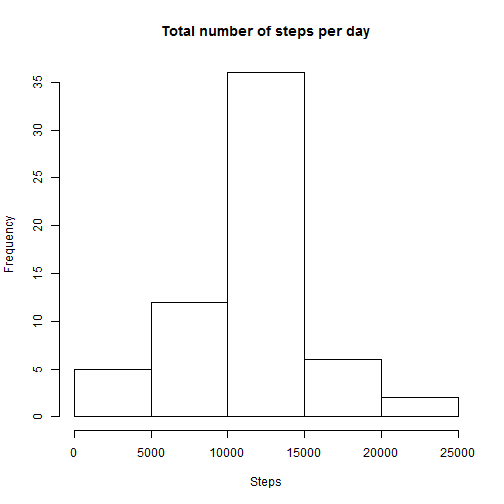
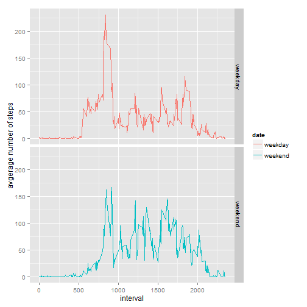

##Loading and preprocessing the data

```r
data <- read.csv("./activity.csv")
```

Required libraries

```r
library(dplyr)
library(lubridate)
library(ggplot2)
```

##What is mean total number of steps taken per day?
Calculate the total number of steps taken per day

```r
q1Total <- data %>%
    group_by(date) %>%
    summarise(total_steps=sum(steps, na.rm=TRUE))
```

Make a histogram of the total number of steps taken each day

```r
hist(q1Total$total_steps, main="Total number of steps per day", xlab="Steps", ylab="Frequency")
```

 

Report the mean and median of the total number of steps taken per day

```r
summary(q1Total)
```

```
##          date     total_steps   
##  2012-10-01: 1   Min.   :    0  
##  2012-10-02: 1   1st Qu.: 6778  
##  2012-10-03: 1   Median :10395  
##  2012-10-04: 1   Mean   : 9354  
##  2012-10-05: 1   3rd Qu.:12811  
##  2012-10-06: 1   Max.   :21194  
##  (Other)   :55
```

##What is the average daily activity pattern?
Make a time series plot (i.e. type = "l") of the 5-minute interval (x-axis) and the average number of steps taken, averaged across all days (y-axis)

```r
q2Avg <- data %>%
    group_by(interval) %>%
    summarise(avg_steps=mean(steps, na.rm=TRUE))
plot(q2Avg$interval, q2Avg$avg_steps, type="l", xlab ="interval", ylab="Average steps")
```

 

Calculate the maximum number of step on average across all the days in the dataset

```r
max_step <- max(q2Avg$avg_steps, na.rm=TRUE)
filter(q2Avg, avg_steps==max_step)
```

```
## Source: local data frame [1 x 2]
## 
##   interval avg_steps
## 1      835  206.1698
```

## Imputing missing values
Calculate and report the total number of missing values in the dataset

```r
summary(data$steps)
```

```
##    Min. 1st Qu.  Median    Mean 3rd Qu.    Max.    NA's 
##    0.00    0.00    0.00   37.38   12.00  806.00    2304
```

Create a new dataset that is equal to the original dataset but with the missing data filled in

```r
new_data <- data
index_of_na <- which(is.na(new_data$steps))
# replaces NA in variable 'steps' of data frame new_data with the average step value
for (i in index_of_na) {
    new_data$steps[i] <- with(q2Avg, avg_steps[interval==new_data$interval[i]])  
}
```

Make a histogram of the total number of steps taken each day 

```r
q3Total <- aggregate(steps~date, new_data, sum)
hist(q3Total$steps, main="Total number of steps per day", xlab="Steps", ylab="Frequency")
```

 

Calculate and report the mean and median total number of steps taken per day. These values differ from the estimates from the first part of the assignment

```r
summary(q3Total)
```

```
##          date        steps      
##  2012-10-01: 1   Min.   :   41  
##  2012-10-02: 1   1st Qu.: 9819  
##  2012-10-03: 1   Median :10766  
##  2012-10-04: 1   Mean   :10766  
##  2012-10-05: 1   3rd Qu.:12811  
##  2012-10-06: 1   Max.   :21194  
##  (Other)   :55
```

## Are there differences in activity patterns between weekdays and weekends?
Create a new factor variable in the dataset with two levels - "weekday" and "weekend" indicating whether a given date is a weekday or weekend day.

```r
q4_data <- new_data
for (i in 1:length(q4_data[,2])) {
    dw <- wday(as.Date(q4_data$date[i]))
    q4_data$dayofweek[i] <- if (dw == 1 || dw == 7) {
        "weekend"
    } else {
        "weekday"
    }
}
```

Make a panel plot containing a time series plot of the 5-minute interval (x-axis) and the average number of steps taken, averaged across all weekday days or weekend days (y-axis).

```r
q4Avg <- aggregate(q4_data$steps, list(interval=q4_data$interval, date=q4_data$dayofweek), mean)
qplot(interval, x, data=q4Avg, color=date, facets=date~., geom=c("line"),
       ylab="avgerage number of steps")
```

 
